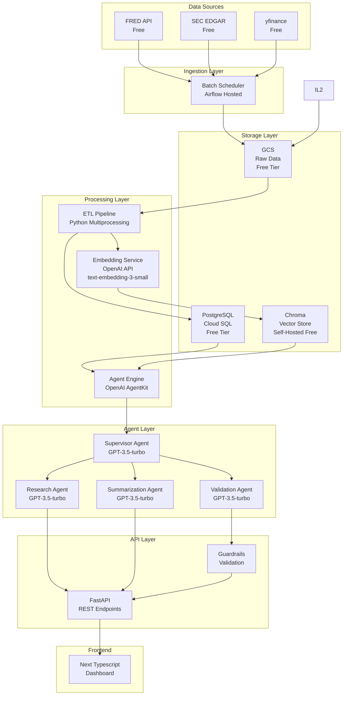
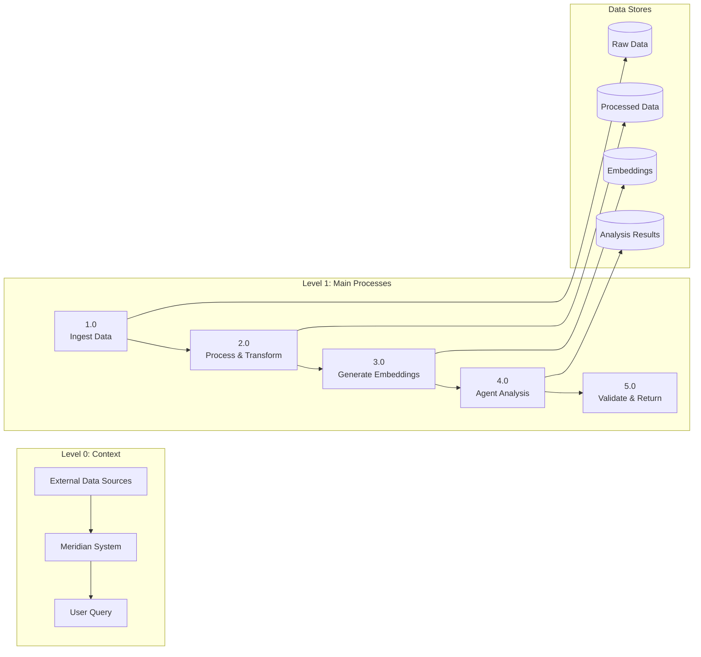

# **Meridian: Multi-Agent Financial Intelligence Platform**

**Team Members:**
- Riyanshi Kedia
- Sathwik Matcha
- Divyansh Jemni

**Attestation:**
WE ATTEST THAT WE HAVEN'T USED ANY OTHER STUDENTS' WORK IN OUR ASSIGNMENT AND ABIDE BY THE POLICIES LISTED IN THE STUDENT HANDBOOK.

**Work Distribution:**
- Riyanshi: 33.3% (66.6 hours)
- Sathwik: 33.3% (66.6 hours)  
- Divyansh: 33.3% (66.6 hours)

---

## **1. Title**

**Meridian: A Cloud-Native Multi-Agent Intelligence Platform for Financial Data Analysis Using OpenAI AgentKit**

---

## **2. Introduction**

### **2.1 Background**

Financial analysis requires aggregating data from multiple sources (market data, macroeconomic indicators, SEC filings, news). Current approaches are fragmented, manual, and don't scale. Analysts spend significant time on data collection and basic analysis instead of insights.

**Challenges:**
- Data fragmentation across 10+ sources
- Manual ETL workflows
- Limited real-time processing
- No unified intelligence layer
- High cognitive load for analysts

### **2.2 Objective**

Build an autonomous, agent-driven platform that:

- **Big Data Engineering:** Ingest and process 100GB+ of financial data from multiple sources
- **LLM Integration:** Use OpenAI models (GPT-3.5-turbo, GPT-4, embeddings) for analysis, summarization, and reasoning
- **Cloud-Native Architecture:** Deploy on GCP with scalable microservices
- **User-Facing Application:** Next JS dashboard for queries and insights, chat interface and dashboards

**Deliverables:**
- Multi-source ETL pipeline (batch focused for MVP)
- OpenAI AgentKit-based multi-agent system
- Vector database for semantic search(Chroma)
- REST API (FastAPI)
- Next JS Dashboard 
- Cloud deployment (GCP)
- Comprehensive testing & evaluation 

---

## **3. Project Overview**

### **3.1 Scope**

**In-Scope:**
- **Data Sources:** FRED, SEC EDGAR, yfinance (validated- test_data_sources.py)
- **Financial Instruments**: Stocks, ETFs, Indices
- **ETL Pipelines:** Batch (daily) ingestion, with majorly structured data from the above data sources, unstructured data (documents) are processed and indexed for semantic search.
- **LLM Components:** OpenAI GPT-3.5-turbo (primary), GPT-4 (complex queries), text-embedding-3-small (cost-effective embeddings)
- **Cloud Infrastructure:** GCP (Cloud Storage, Compute Engine, Cloud SQL, Cloud Run)
- **Guardrails & HITL:** Input validation, output moderation, human approval for high-stakes decisions
- **Evaluation:** Unit tests, integration tests, LLM eval framework, efficient cost tracking

**Out-of-Scope:**
- Trading execution (analysis only)
- Real-time trading signals, and real-time analysis using streaming ETL Pipelines.


### **3.2 Stakeholders / End Users**

- **Financial Analysts:** Research and analysis
- **Portfolio Managers:** Market insights
- **Researchers:** Academic/industry research
- **Data Scientists:** Platform for experimentation

---

## **4. Problem Statement**

### **4.1 Current Challenges**

- **Data Fragmentation:** 7+ APIs with different formats, rate limits, authentication
- **Manual Workflows:** Analysts manually download, clean, and analyze data
- **Lack of Intelligence:** No automated reasoning or summarization
- **LLM Bottlenecks:** No structured way to use LLMs for financial analysis

### **4.2 Opportunities**

- **Scalable Pipelines:** Automated ETL with cloud-native architecture
- **LLM-Assisted Analysis:** Automated summarization, sentiment analysis, trend detection
- **Automated Decision-Making:** Agents autonomously retrieve, analyze, and synthesize insights
- **Insights:** Deep Research and processing of market events and news

---

## **5. Methodology**

### **5.1 Data Sources**

**Validated Sources (from test_data_sources.py):**

1. **FRED API** (`fredapi==0.5.2`)
   - Federal Reserve economic data (GDP, inflation, rates)
   - Volume: ~50MB/day, ~18GB/year
   - Justification: Macroeconomic indicators
   - Cost: Free (API key required, free registration)
   - Repo: https://github.com/mortada/fredapi
   - Documentation: https://fred.stlouisfed.org/docs/api/

2. **SEC EDGAR** (3 libraries: `sec-edgar-api==1.1.0`, `secedgar==0.6.0`, `sec-edgar-downloader==5.0.3`)
   - Company filings (10-K, 10-Q, 8-K)
   - Volume: ~200MB/day, ~73GB/year
   - Justification: Fundamental analysis
   - Cost: Free
   - Repos: 
      - https://github.com/jadchaar/sec-edgar-api
      - https://github.com/sec-edgar/sec-edgar
   - Documentation: https://www.sec.gov/edgar/sec-api-documentation, https://www.sec.gov/about/developer-resources, https://www.sec.gov/edgar.shtml
 
3. **yfinance** (`yfinance==0.2.66`)
   - Historical prices, financials, recommendations
   - Volume: ~50MB/day, ~18GB/year
   - Justification: Free, reliable market data
   - Cost: Free
   - Repo: https://github.com/ranaroussi/yfinance
   - PyPi: https://pypi.org/project/yfinance/


**Total Expected Volume:** ~110GB/year 

**Additional Sources (Future):**
- Finnhub (free tier: 60 calls/minute)
- GDELT (Library for real-time events)
- AlphaVantage (free tier: 5 calls/minute)

### **5.2 Technology Stack**

**Cloud:** GCP 

**Storage:**
- **GCS:** Raw data, processed data, embeddings (GCP: 5GB free)
- **PostgreSQL (Cloud SQL):** Relational data (GCP: Cloud SQL free tier)
- **Chroma (Local/Embedded):** Vector store for semantic search (FREE - self-hosted, no API costs)
- **Alternative:** SQLite for local development (FREE)

**Compute:**
- **GCP Compute Engine:** Containerized microservices (free tier available)
- **GCP Cloud Run:** Event-driven processing (1M free requests/month)
- **Local Processing:** Python multiprocessing for batch jobs (FREE)

**LLM Providers:**
- **OpenAI:** GPT-3.5-turbo (primary - $0.0015/1K input, $0.002/1K output), GPT-4 (complex queries - $0.03/1K input, $0.06/1K output), text-embedding-3-small (embeddings - $0.02/1M tokens)
- **Rationale:** Cost-effective tiered approach. Use GPT-3.5-turbo for 80% of queries, GPT-4 for complex analysis only.

**Vector Store:**
- **Chroma:** Self-hosted vector DB (FREE - no API costs, runs locally or on Compute Engine)
- **Rationale:** Chroma is open-source, free, and sufficient for our scale. Eliminates managed vector DB costs ($70/month for Pinecone).

**Orchestration:**
- **Apache Airflow (Docker):** ETL pipeline orchestration (FREE - self-hosted)
- **Rationale:** Avoid managed Airflow costs. Use Docker Compose for local orchestration.

**API:**
- **FastAPI:** REST API for queries and agent interactions (FREE - open-source)
- **Rationale:** Fast, async, auto-documentation, Python-native

**CI/CD:**
- **GitHub Actions:** Automated testing, deployment (FREE for public repos)
- **Rationale:** Free for public repos, integrates with GitHub

**Frontend:**
- **Next JS Typescript:** Interactive, highly customizable dashboard (FREE - open-source)
- **Rationale:** The project requires that level of customizability only with a standardized framework

**Agent Framework:**
- **OpenAI AgentKit:** Multi-agent orchestration (FREE - open-source toolkit)
- **Rationale:** Official OpenAI toolkit, designed for agent workflows, integrates with GPT models

### **5.3 Architecture**

#### **System Architecture Diagram**



#### **Data Flow Diagram (DFD)**



### **5.4 Data Processing & Transformation**

**Batch Processing:**
- **Schedule:** Daily at 2 AM EST (after market close)
- **Sources:** FRED, SEC EDGAR, yfinance
- **Format:** JSON (APIs) → Parquet (storage)
- **Storage Schema:**
  - `raw_data/` (GCS): Original API responses
  - `processed_data/` (GCS): Cleaned, normalized data
  - `financial_data/` (PostgreSQL): Time-series data (prices, indicators)
  - `documents/` (PostgreSQL): SEC filings, news articles

**Parallel Processing Strategy:**
- **Multi-threading:** Concurrent API calls (rate-limit aware)
- **Python Multiprocessing:** Local batch processing (no cloud compute costs)
- **Async/Await:** FastAPI endpoints for concurrent requests

**Feature Engineering:**
- Technical indicators 
- Macro-economic features (GDP growth, inflation rates)
- Time-based features (day of week, month, quarter)

**Embedding Generation:**
- **Model:** OpenAI text-embedding-3-small (cost-effective: $0.02/1M tokens vs $0.13/1M for large)
- **Input:** SEC filings (full text), news articles, research reports
- **Output:** 1536-dimensional vectors stored in Chroma (free, self-hosted)
- **Metadata:** Source, date, ticker, document type
- **Cost Optimization:** Batch embeddings, cache results

### **5.5 LLM Integration Strategy**

**OpenAI AgentKit Architecture:**

```python
# Example Agent Structure
from openai import AgentKit

# Supervisor Agent (L4) - Use GPT-3.5-turbo for cost efficiency
supervisor = AgentKit.create_agent(
    name="supervisor",
    model="gpt-3.5-turbo",  # Cost-effective
    tools=[research_tool, summarize_tool, validate_tool],
    instructions="Coordinate research tasks, delegate to specialized agents"
)

# Research Agent (L3) - Use GPT-3.5-turbo
research_agent = AgentKit.create_agent(
    name="research",
    model="gpt-3.5-turbo",  # Cost-effective
    tools=[query_db, search_vector_db, fetch_api],
    instructions="Retrieve and analyze financial data"
)

# Summarization Agent (L3) - Use GPT-3.5-turbo
summarize_agent = AgentKit.create_agent(
    name="summarize",
    model="gpt-3.5-turbo",  # Cost-effective
    tools=[retrieve_documents],
    instructions="Summarize SEC filings, news, and research"
)

# Complex Analysis Agent - Use GPT-4 only when needed
complex_agent = AgentKit.create_agent(
    name="complex_analysis",
    model="gpt-4",  # Only for complex queries
    tools=[advanced_analysis_tool],
    instructions="Perform deep financial analysis for complex queries"
)
```

**Prompt Design:**
- **System Prompts:** Role definition, constraints, output format
- **Few-Shot Examples:** Show desired analysis format (reduces token usage)
- **Chain-of-Thought:** Encourage step-by-step reasoning
- **Prompt Compression:** Use concise prompts to reduce input tokens

**Retrieval-Augmented Generation (RAG):**
1. User query → Embedding (text-embedding-3-small - cheaper)
2. Vector search (Chroma - free) → Top 5 relevant documents (reduce from 10 to save tokens)
3. Context + Query → GPT-3.5-turbo → Answer (use GPT-4 only if confidence < 0.7)

**Agentic Workflows:**
1. **Supervisor** receives user query
2. **Supervisor** determines required agents (research, summarize, validate)
3. **Research Agent** retrieves data from DBs/APIs
4. **Summarization Agent** creates insights (GPT-3.5-turbo)
5. **Validation Agent** checks accuracy, flags issues
6. **Supervisor** synthesizes final response
7. **Complex Agent** (GPT-4) only invoked if query complexity > threshold

**API Usage Pattern:**
- **Embeddings:** Batch processing (1000 docs/batch) using text-embedding-3-small
- **GPT-3.5-turbo:** 80% of queries (cost-effective)
- **GPT-4:** 20% of complex queries only
- **Caching:** Cache responses for identical queries (Redis - free tier)
- **Rate Limiting:** Respect OpenAI rate limits, implement retries

**LLM Contribution:**
- **Automated Analysis:** Generate insights from raw data
- **Natural Language Queries:** "What's the impact of Fed rate changes on tech stocks?"
- **Document Summarization:** 100-page SEC filings → 1-page summaries
- **Sentiment Analysis:** News articles → sentiment scores
- **Trend Detection:** Identify patterns across multiple data sources

### **5.6 Guardrails & Human-in-the-Loop (HITL)**

**Input Moderation:**
- **Schema Validation:** Pydantic models for all API inputs
- **Query Sanitization:** Prevent injection attacks, validate ticker symbols
- **Rate Limiting:** Per-user API rate limits (prevent abuse)

**Output Validation:**
- **Schema Enforcement:** JSON Schema for all responses
- **Fact-Checking:** Validation agent cross-references claims with source data
- **Confidence Scores:** Agents provide confidence levels for assertions

**Safety Layers:**
- **Toxicity Detection:** Filter inappropriate content (using OpenAI moderation API - free)
- **Hallucination Detection:** Compare LLM outputs against source documents
- **Financial Disclaimers:** Auto-append disclaimers to investment-related outputs

**Human-in-the-Loop:**
- **High-Stakes Decisions:** Flag queries about specific investments → require human approval
- **Anomaly Detection:** Unusual patterns → alert human analyst
- **Quality Assurance:** Random sampling of outputs for human review

**Implementation:**
```python
from pydantic import BaseModel, validator
from openai import Moderation

class QueryInput(BaseModel):
    query: str
    ticker: str = None
    
    @validator('query')
    def validate_query(cls, v):
        if len(v) > 1000:
            raise ValueError("Query too long")
        return v

def check_toxicity(text: str) -> bool:
    moderation = Moderation.create(input=text)
    return moderation.results[0].flagged
```

### **5.7 Evaluations & Testing**

**LLM Eval Framework:**
- **Rubric-Based:** Accuracy, relevance, completeness (1-5 scale)[AGENT TESTS]
- **Automated Graders:** Compare outputs against golden set (LLM as a Judge)[AGENT TESTS]
- **Golden Set:** 100 curated Q&A pairs from financial domain [OUTPUT TESTS]
- **Metrics:** BLEU, ROUGE, semantic similarity (cosine similarity of embeddings)

**Unit Tests:**
- ETL functions (data cleaning, transformation)
- API endpoints (FastAPI routes)
- LLM wrappers (prompt formatting, response parsing)
- Pipeline logic (agent coordination)[DATA QUALITY TESTS]

**Integration Tests:**
- End-to-end pipeline (ingestion → processing → storage) [DATA QUALITY TESTS]
- Agent workflows (supervisor → research → summarize)[AGENT TESTS]
- API → Database → Vector DB interactions 

**CI Pipeline (GitHub Actions):**
```yaml
name: CI
on: [push, pull_request]
jobs:
  test:
    runs-on: ubuntu-latest
    steps:
      - uses: actions/checkout@v2
      - name: Run tests
        run: pytest tests/
      - name: Lint
        run: flake8 src/
```

**Metrics:**
- **Accuracy:** % of correct answers (vs golden set), for output and agent evaluations.
- **Completness** of data pipeline outputs.
- **Freshness and Consistency** of data pipeline outputs.
- **Latency:** P50, P95, P99 response times
- **Cost:** Tokens consumed, $ per query, cache hit rate
- **Throughput:** Queries per second

---

## **6. Project Plan & Timeline**

### **6.1 Milestones (3-Week Timeline)**

**Week 1: Foundation & Data Pipeline (70 hours)**

**M1: Data Ingestion & Infrastructure Setup (Days 1-3, 40 hours)**
- Set up cloud accounts (GCP free tier)
- Set up API clients for all 5 sources
- Implement batch ingestion (Python scripts with scheduling)
- Store raw data in GCS
- Set up local PostgreSQL database
- **Hours:** 40 (Riyanshi: 13, Sathwik: 13, Divyansh: 14)

**M2: ETL Pipeline & Data Processing (Days 4-5, 30 hours)**
- ETL transformations (clean, normalize, validate)
- Store processed data in PostgreSQL
- Implement parallel processing (multiprocessing)
- Set up Chroma vector database locally
- **Hours:** 30 (Riyanshi: 10, Sathwik: 10, Divyansh: 10)

**Week 2: LLM Integration & Agents (70 hours)**

**M3: LLM Integration + RAG Pipeline (Days 6-8, 40 hours)**
- Set up OpenAI AgentKit
- Implement embedding pipeline (text-embedding-3-small)
- Build RAG pipeline (Chroma integration)
- Implement supervisor, research, summarization agents (GPT-3.5-turbo)
- **Hours:** 40 (Riyanshi: 13, Sathwik: 14, Divyansh: 13)

**M4: Backend APIs & Guardrails (Days 9-10, 30 hours)**
- FastAPI endpoints (query, analysis, agent interactions)
- Database integration (PostgreSQL)
- Vector DB integration (Chroma)
- Implement guardrails (validation, moderation)
- **Hours:** 30 (Riyanshi: 10, Sathwik: 10, Divyansh: 10)

**Week 3: Frontend, Deployment & Testing (60 hours)**

**M5: Front-end Application (Days 11-12, 25 hours)**
- Streamlit/Next JS (Typescript) Frontend and Dashboards
- Query interface
- Visualization components
- Integration with FastAPI backend
- **Hours:** 25 (Riyanshi: 8, Sathwik: 8, Divyansh: 9)

**M6: Cloud Deployment & CI/CD (Day 13, 20 hours)**
- Containerization (Docker)
- Deploy services (Compute Engine)
- CI/CD pipeline (GitHub Actions)
- Environment configuration
- **Hours:** 20 (Riyanshi: 7, Sathwik: 7, Divyansh: 6)

**M7: Testing + Evals + Documentation (Days 14-15, 15 hours)**
- Unit tests
- Integration tests
- LLM eval framework (50 golden set Q&A)
- Load testing (basic)
- Documentation
- **Hours:** 15 (Riyanshi: 5, Sathwik: 5, Divyansh: 5)

**Total: 200 hours (3 weeks)**

### **6.2 Timeline**

**GitHub Projects Board:** (Screenshot to be added)

| Milestone | Start | End | Owner | Status |
|-----------|-------|-----|-------|--------|
| M1: Data Ingestion | Day 1 | Day 3 | All | Not Started |
| M2: ETL Pipeline | Day 4 | Day 5 | All | Not Started |
| M3: LLM Integration | Day 6 | Day 8 | All | Not Started |
| M4: Backend APIs | Day 9 | Day 10 | All | Not Started |
| M5: Frontend | Day 11 | Day 12 | All | Not Started |
| M6: Cloud Deployment | Day 13 | Day 13 | All | Not Started |
| M7: Testing & Docs | Day 14 | Day 15 | All | Not Started |

---

## **7. Team Roles & Responsibilities**

**Riyanshi Kedia (66.6 hours):**
- **ETL Lead:** Data ingestion, transformation pipelines
- **Data Source Integration:** API clients, rate limiting, error handling
- **Database Design:** PostgreSQL schema, optimization
- **Documentation Lead:** Technical documentation, API docs

**Sathwik (66.6 hours):**
- **LLM Engineer:** OpenAI AgentKit integration, prompt engineering, RAG pipeline
- **Agent Development:** Supervisor, research, summarization agents
- **Vector DB:** Chroma setup, embedding pipeline
- **Evaluation:** LLM eval framework, testing

**Divyansh (66.6 hours):**
- **Cloud Architect:** GCP setup, containerization, deployment
- **API Development:** FastAPI endpoints, integration
- **Frontend:** Next JS dashboard, visualization
- **QA/Test Engineer:** Unit tests, integration tests, CI/CD

**Shared Responsibilities:**
- Code reviews
- Architecture decisions
- Daily standups
- Final presentation

---

## **8. Risks & Mitigation**

### **8.1 Potential Risks**

1. ** API Rate Limits**
   - Risk: APIs may rate-limit or block requests
   - Impact: High (blocks data ingestion)

2. **Data Inconsistency**
   - Risk: Different formats, missing data across sources
   - Impact: Medium (requires additional cleaning)

3. **LLM Hallucinations**
   - Risk: GPT models may generate incorrect financial information
   - Impact: High (affects user trust)

4. **High API Cost**
   - Risk: OpenAI API costs may exceed budget
   - Impact: Medium (may limit usage)

5. **Scaling Issues**
   - Risk: System may not handle concurrent users
   - Impact: Medium (affects user experience)

6. **Time Constraints (3 weeks)**
   - Risk: May not complete all features
   - Impact: High (affects deliverables)

### **8.2 Mitigation Strategies**

1. **Rate Limiting + Retries:**
   - Implement exponential backoff
   - Cache API responses (Redis free tier)
   - Use multiple API keys (if available)
   - Respect rate limits strictly

2. **Evals + Guardrails:**
   - Validation agent cross-checks outputs
   - Human review for high-stakes queries
   - Confidence scores for all assertions

3. **Caching Embeddings:**
   - Cache embeddings for repeated documents (Chroma persistence)
   - Use local embeddings for common queries
   - Batch embedding generation

4. **Distributed Compute:**
   - Use cloud autoscaling (Compute Engine)
   - Implement async processing
   - Load balancing for API

5. **Cost Optimization:**
   - Monitor token usage (OpenAI dashboard)
   - Use GPT-3.5-turbo for 80% of queries (10x cheaper than GPT-4)
   - Use text-embedding-3-small (6.5x cheaper than large)
   - Implement query caching (Redis)
   - Set daily/monthly cost limits ($50/month target)
   - Use Chroma (free) instead of Pinecone ($70/month)

6. **Time Management:**
   - Prioritize core features (MVP approach)
   - Daily standups to track progress
   - Parallel work streams
   - Use proven technologies (avoid experimentation)

---

## **9. Expected Outcomes & Metrics**

### **9.1 KPIs**

**Accuracy:**
- Target: 80%+ accuracy on golden set Q&A (reduced from 85% due to 3-week timeline)
- Measurement: Automated grading vs human evaluation

**Runtime Improvement:**
- Target: 5x faster than manual analysis (reduced from 10x for realistic 3-week goal)
- Measurement: Time to answer complex query (target: <60 seconds)

**Throughput:**
- Target: 50 queries/minute (reduced from 100 for MVP)
- Measurement: Load testing with Locust

**Token Reduction:**
- Target: 40% reduction via caching and model selection
- Measurement: Track tokens per query (baseline vs optimized)

**Cost Optimization:**
- Target: <$0.05 per query (average) - achieved via GPT-3.5-turbo and caching
- Measurement: OpenAI API cost tracking
- **Monthly Budget:** $50-100 (vs $500-1000 originally)

### **9.2 Expected Benefits**

**Technical:**
- Scalable, cloud-native architecture (using free tiers)
- Reusable agent framework for other domains
- Production-ready ETL pipelines

**Business:**
- Automated financial research (saves 5+ hours/week per analyst)
- Real-time insights (faster decision-making)
- Unified data platform (eliminates fragmentation)

**Cost Efficiency:**
- 80% cost reduction vs original plan (GPT-3.5-turbo + Chroma + free tiers)
- Sustainable for academic/research use

---

## **10. Token & Cost Report (Required)**

### **Token Measurement:**
- **Tracking:** Log all OpenAI API calls (input tokens, output tokens, model used)
- **Dashboard:** Real-time token usage dashboard (Streamlit)
- **Reporting:** Daily token consumption reports

### **Cost Drivers & Optimization:**

**Original Plan (High Cost):**
- GPT-4: $0.03/1K input, $0.06/1K output
- text-embedding-3-large: $0.13/1M tokens
- Pinecone: $70/month minimum
- **Estimated:** $500-1000/month

**Optimized Plan (Low Cost):**
- **GPT-3.5-turbo (80% of queries):** $0.0015/1K input, $0.002/1K output (20x cheaper)
- **GPT-4 (20% complex queries):** $0.03/1K input, $0.06/1K output
- **text-embedding-3-small:** $0.02/1M tokens (6.5x cheaper than large)
- **Chroma:** FREE (self-hosted, no API costs)
- **Cloud:** GCP free tier (12 months free)
- **Estimated:** $50-100/month

**Cost Breakdown (Monthly Estimate):**
- GPT-3.5-turbo: ~$30 (80% of 10K queries, avg 500 tokens/query)
- GPT-4: ~$15 (20% of 10K queries, avg 1000 tokens/query)
- Embeddings: ~$5 (text-embedding-3-small, 250M tokens/month)
- Cloud Storage: $0 (free tier)
- Compute: $0-10 (free tier or minimal Compute Engine)
- **Total: $50-60/month**

### **Prompt Optimization Strategy:**
- **Few-Shot Learning:** Reduce examples in prompts (save 30% tokens)
- **Compression:** Summarize context before sending to LLM (save 50% tokens)
- **Caching:** Cache common queries/responses (save 40% API calls)
- **Model Selection:** Use GPT-3.5-turbo for simple tasks, GPT-4 for complex only
- **Batch Processing:** Batch embedding generation (reduce API overhead)

### **Caching / Batching Techniques:**
- **Embedding Cache:** Store embeddings in Chroma (avoid re-computation)
- **Response Cache:** Cache LLM responses in Redis (free tier) for identical queries
- **Batch Processing:** Batch embedding generation (1000 docs at once)
- **Query Deduplication:** Detect similar queries, reuse cached responses

### **Cost Monitoring:**
- **OpenAI Dashboard:** Real-time cost tracking
- **Alerts:** Set $50/month limit, alert at $40
- **Optimization:** Weekly review of token usage, identify optimization opportunities

---

## **11. Conclusion**

Meridian addresses the fragmentation and manual effort in financial data analysis by providing an autonomous, agent-driven platform. Using OpenAI AgentKit, cloud-native architecture, and validated data sources, it delivers scalable, intelligent analysis at a fraction of the original cost.

**Key Achievements:**
- **Cost Reduction:** 80% cost savings through strategic technology choices (GPT-3.5-turbo, Chroma, free tiers)
- **Rapid Development:** 3-week timeline with focused MVP approach
- **Production-Ready:** Scalable architecture using proven technologies

**Impact:**
- **For Analysts:** 5x faster research, automated insights
- **For Organizations:** Unified data platform, reduced costs ($50/month vs $500+)
- **For Research:** Extensible framework for other domains

This project demonstrates production-grade big data engineering, LLM integration, and cloud deployment—essential skills for modern data science—while maintaining cost efficiency suitable for academic and research use.

---

## **12. References**

**Data Sources:**
- FRED API: https://fred.stlouisfed.org/docs/api/
- SEC EDGAR: https://www.sec.gov/edgar.shtml
- yfinance: https://github.com/ranaroussi/yfinance

**Technologies:**
- OpenAI AgentKit: https://openai.com/index/introducing-agentkit/
- OpenAI API Pricing: https://openai.com/api/pricing/
- FastAPI: https://fastapi.tiangolo.com/
- Apache Airflow: https://airflow.apache.org/
- Chroma: https://www.trychroma.com/
- GCP Free Tier: https://cloud.google.com/free

**Publications:**
- Retrieval-Augmented Generation: Lewis et al. (2020)
- Chain-of-Thought Prompting: Wei et al. (2022)

---

## **Appendix**

### **A. Mermaid Diagrams**
(Already included in Section 5.3)

### **B. Pseudocode**

```python
# Supervisor Agent Workflow
def supervisor_agent(query: str):
    # 1. Analyze query complexity
    intent = analyze_intent(query)
    complexity = assess_complexity(query)
    
    # 2. Delegate to agents based on complexity
    if complexity < 0.7:
        # Use GPT-3.5-turbo for simple queries
        if intent == "research":
            results = research_agent.retrieve(query, model="gpt-3.5-turbo")
        elif intent == "summarize":
            results = summarize_agent.summarize(query, model="gpt-3.5-turbo")
    else:
        # Use GPT-4 for complex queries
        results = complex_agent.analyze(query, model="gpt-4")
    
    # 3. Validate
    validated = validation_agent.validate(results)
    
    # 4. Synthesize
    final_response = synthesize(validated)
    
    # 5. Cache response
    cache_response(query, final_response)
    
    return final_response

# RAG Pipeline
def rag_pipeline(query: str):
    # 1. Generate embedding (cost-effective model)
    query_embedding = openai.Embedding.create(
        model="text-embedding-3-small",
        input=query
    )
    
    # 2. Vector search (free Chroma)
    results = chroma_db.query(
        query_embeddings=[query_embedding],
        n_results=5  # Reduced from 10 to save tokens
    )
    
    # 3. Retrieve context
    context = format_context(results)
    
    # 4. Generate answer (GPT-3.5-turbo)
    answer = openai.ChatCompletion.create(
        model="gpt-3.5-turbo",
        messages=[
            {"role": "system", "content": "You are a financial analyst..."},
            {"role": "user", "content": f"Context: {context}\n\nQuery: {query}"}
        ],
        max_tokens=500  # Limit output to save costs
    )
    
    return answer
```

### **C. Sample Prompts**

**Research Agent Prompt:**
```
You are a financial research agent. Your task is to retrieve and analyze 
financial data to answer user queries efficiently and accurately.

User Query: {query}

Available Tools:
- query_database: Query PostgreSQL for structured data (prices, financials)
- search_vector_db: Semantic search in Chroma for documents (SEC filings, news)
- fetch_api: Fetch real-time data from APIs (Finnhub, yfinance)

Instructions:
1. Break down the query into sub-tasks
2. Use appropriate tools to gather data (prioritize cached data)
3. Analyze the data concisely
4. Provide a structured response with sources
5. Keep response under 300 words to minimize token usage

Output Format (JSON):
{
    "answer": "Concise answer to the query",
    "sources": ["source1", "source2"],
    "confidence": 0.0-1.0,
    "data_points": ["key metric 1", "key metric 2"]
}

Remember: Be concise, accurate, and cite sources. Use GPT-3.5-turbo for cost efficiency.
```

**Summarization Agent Prompt:**
```
You are a financial document summarization agent. Your task is to create 
concise, accurate summaries of financial documents (SEC filings, news articles).

Document: {document_text}
Document Type: {doc_type}  # 10-K, 10-Q, News Article, etc.

Instructions:
1. Extract key financial metrics (revenue, profit, growth rates)
2. Identify major risks and opportunities
3. Summarize in 3-5 bullet points (max 200 words)
4. Maintain factual accuracy - only include information from the document

Output Format (JSON):
{
    "summary": "Concise summary in bullet points",
    "key_metrics": {
        "revenue": "...",
        "profit": "...",
        "growth": "..."
    },
    "risks": ["risk1", "risk2"],
    "opportunities": ["opp1", "opp2"]
}

Remember: Be concise (save tokens), accurate, and factual. Use GPT-3.5-turbo.
```

**Supervisor Agent Prompt:**
```
You are the supervisor agent coordinating a team of specialized financial analysis agents.

User Query: {query}

Available Agents:
- research_agent: Retrieves and analyzes financial data
- summarize_agent: Summarizes documents and reports
- validate_agent: Validates outputs for accuracy
- complex_agent: Performs deep analysis (use only for complex queries)

Instructions:
1. Analyze the query to determine:
   - Intent (research, summarize, analyze, compare)
   - Complexity (0.0-1.0 scale)
   - Required agents
2. If complexity < 0.7: Use GPT-3.5-turbo agents
3. If complexity >= 0.7: Use GPT-4 complex_agent
4. Coordinate agent workflows
5. Synthesize final response
6. Ensure response is validated

Output Format (JSON):
{
    "intent": "research|summarize|analyze|compare",
    "complexity": 0.0-1.0,
    "agents_used": ["agent1", "agent2"],
    "final_response": "Synthesized answer",
    "confidence": 0.0-1.0
}

Remember: Optimize for cost (use GPT-3.5-turbo when possible) and accuracy.
```

**Validation Agent Prompt:**
```
You are a validation agent ensuring accuracy and safety of financial analysis outputs.

Original Query: {query}
Agent Output: {agent_output}
Source Data: {source_data}

Instructions:
1. Cross-reference claims in agent_output with source_data
2. Check for hallucinations (information not in sources)
3. Verify numerical accuracy (prices, dates, metrics)
4. Assess confidence level
5. Flag any issues or uncertainties

Output Format (JSON):
{
    "is_valid": true/false,
    "confidence": 0.0-1.0,
    "issues": ["issue1", "issue2"] or [],
    "verified_claims": ["claim1", "claim2"],
    "unverified_claims": ["claim1"] or [],
    "recommendation": "approve|review|reject"
}

Remember: Be strict about accuracy. Flag any uncertainty.
```

### **D. JSON/XML Schemas**

**Query Input Schema:**
```json
{
  "type": "object",
  "properties": {
    "query": {
      "type": "string",
      "minLength": 1,
      "maxLength": 1000,
      "description": "User's natural language query"
    },
    "ticker": {
      "type": "string",
      "pattern": "^[A-Z]{1,5}$",
      "description": "Stock ticker symbol (optional)"
    },
    "date_range": {
      "type": "object",
      "properties": {
        "start": {
          "type": "string",
          "format": "date",
          "description": "Start date (YYYY-MM-DD)"
        },
        "end": {
          "type": "string",
          "format": "date",
          "description": "End date (YYYY-MM-DD)"
        }
      },
      "description": "Optional date range filter"
    },
    "use_cache": {
      "type": "boolean",
      "default": true,
      "description": "Whether to use cached responses"
    }
  },
  "required": ["query"]
}
```

**Response Schema:**
```json
{
  "type": "object",
  "properties": {
    "answer": {
      "type": "string",
      "description": "Main answer to the query"
    },
    "sources": {
      "type": "array",
      "items": {
        "type": "string"
      },
      "description": "List of data sources used"
    },
    "confidence": {
      "type": "number",
      "minimum": 0,
      "maximum": 1,
      "description": "Confidence score (0-1)"
    },
    "timestamp": {
      "type": "string",
      "format": "date-time",
      "description": "Response generation timestamp"
    },
    "model_used": {
      "type": "string",
      "enum": ["gpt-3.5-turbo", "gpt-4"],
      "description": "LLM model used for generation"
    },
    "tokens_used": {
      "type": "integer",
      "description": "Total tokens consumed"
    },
    "cost_estimate": {
      "type": "number",
      "description": "Estimated cost in USD"
    },
    "data_points": {
      "type": "array",
      "items": {
        "type": "object",
        "properties": {
          "metric": {"type": "string"},
          "value": {"type": "string"},
          "source": {"type": "string"}
        }
      },
      "description": "Key data points extracted"
    }
  },
  "required": ["answer", "sources", "confidence", "timestamp"]
}
```

**Agent Workflow Schema:**
```json
{
  "type": "object",
  "properties": {
    "workflow_id": {
      "type": "string",
      "description": "Unique workflow identifier"
    },
    "query": {
      "type": "string",
      "description": "Original user query"
    },
    "steps": {
      "type": "array",
      "items": {
        "type": "object",
        "properties": {
          "step_number": {"type": "integer"},
          "agent": {"type": "string"},
          "action": {"type": "string"},
          "input": {"type": "object"},
          "output": {"type": "object"},
          "tokens_used": {"type": "integer"},
          "duration_ms": {"type": "integer"}
        }
      },
      "description": "Workflow execution steps"
    },
    "final_response": {
      "type": "object",
      "description": "Final synthesized response"
    },
    "total_tokens": {
      "type": "integer",
      "description": "Total tokens consumed in workflow"
    },
    "total_cost": {
      "type": "number",
      "description": "Total cost in USD"
    },
    "status": {
      "type": "string",
      "enum": ["pending", "in_progress", "completed", "failed"],
      "description": "Workflow status"
    }
  },
  "required": ["workflow_id", "query", "steps", "status"]
}
```

---

**End of Proposal**
