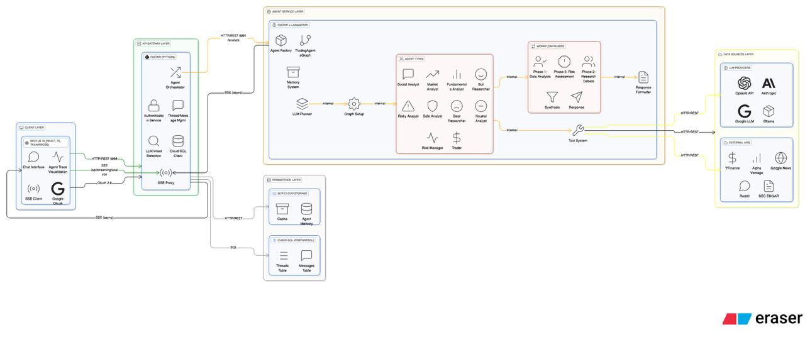

# Final Project Proposal: Multi-Agent AI Trading Intelligence System

**DAMG 7245 — Big Data and Intelligent Analytics**  


## Team Members:
- Riyanshi Kedia
- Sathwik Matcha
- Divyans Jemni

## Attestation (Required):
WE ATTEST THAT WE HAVEN'T USED ANY OTHER STUDENTS' WORK IN OUR ASSIGNMENT AND ABIDE BY THE POLICIES LISTED IN THE STUDENT HANDBOOK.

- Riyanshi Kedia: 33.3%
- Sathwik Matcha: 33.3%
- Divyans Jemni: 33.3%

---

## Repository Operations (Constitution-Aligned)

- **Services & Docs**
  - Frontend (Next.js): `meridian-frontend/` with docs in `docs/frontend`.
  - Backend (FastAPI): `meridian-backend/` with docs in `docs/backend`.
  - Agents (Agents + FastAPI + LangGraph): `meridian-agents/` with docs in `docs/agents` and eval guide in `docs/agents/EVAL_DOCUMENTATION.md`.

- **Setup**
  - Python 3.11+: `pip install -r requirements.txt`
  - Install gcloud cli before starting script runs.
  - Node 20+: `cd meridian-frontend && npm install`
  - Env (examples): `OPENAI_API_KEY`, `AGENTS_SERVICE_URL`, `INSTANCE_CONNECTION_NAME`, `DB_USER`, `DB_PASS`, `DB_NAME`, `DB_TYPE`, `GOOGLE_APPLICATION_CREDENTIALS`.

- **Run**
   Run all services simply using docker, instead of running them locally.

   Make sure you have set your relevant variables in .env and meridian-frontend/.env.production

- **Testing**
  - Backend: `cd meridian-backend && pytest -v` (DB env vars required for DB tests)
  - Agents: `cd meridian-agents && pytest -v`
  - Frontend: `cd meridian-frontend && npm test` (lint via `npm run lint`)

- **Agent Evaluations**
   `cd meridian-agents/tests/evals`
   `python run_eval.py` (python3 if you use python3 or later)

- **CI/CD**
  - Deploy (`.github/workflows/deploy.yml`): GitHub Actions workflow that builds Docker images and deploys backend and agents services to Google Cloud Run. Uses key secrets: `GCP_SA_KEY`, `GCP_PROJECT_ID`, `CLOUD_RUN_REGION`, among others.
  - Agent Evaluation (`.github/workflows/eval.yml`): GitHub Actions workflow for manual or on-demand evaluation runs of all LLM agents; triggered with custom inputs for ticker/date. Requires secrets: `OPENAI_API_KEY`, `GCP_PROJECT_ID`, and data provider credentials.

- **Disclosures**
  - AI tooling: OpenAI GPT models used for agent inference; evaluations rely on same provider; Used Cursor and Github Spec-kit for deployment.
  - Cloud: GCP (Cloud Run, Cloud SQL). Secrets must be stored in GitHub Secrets or GCP Secret Manager; no plaintext commits.

-- **Resources to Refer**

   - Codelabs URL: https://codelabs-preview.appspot.com/?file_id=1Y3G1tT2-ot427MmtY5ijG5mVptIHaUzSP7aKOZF_CIk#0
   - Video Demo: https://drive.google.com/drive/folders/1kK_lS2HqRtlUVU5WdBvE0ZKYE7lrd_r0?usp=sharing
   - Project Live URL: https://meridian-frontend-959890924234.us-central1.run.app/chat
   - Project Backend URL: https://meridian-backend-959890924234.us-central1.run.app/chat

---

## 1. Title
**Multi-Agent AI Trading Intelligence System: A Cloud-Native Platform for Collaborative Investment Decision-Making Using Large Language Models**

---

## 2. Introduction

### 2.1 Background
Financial markets generate massive volumes of heterogeneous data daily—real-time price feeds, financial statements, news articles, social media sentiment, and technical indicators. Traditional trading systems rely on rigid rule-based algorithms or single-model approaches that fail to capture the nuanced, multi-perspective analysis human traders perform. The challenge lies in:

- **Data fragmentation**: Financial data exists across multiple sources (market APIs, news feeds, social media) in various formats
- **Complexity of analysis**: Sound investment decisions require synthesizing technical analysis, fundamental metrics, sentiment analysis, and risk assessment
- **Scale challenges**: Processing millions of data points in real-time while maintaining low latency
- **Bias and overconfidence**: Single-model systems lack the adversarial debate that improves decision quality

This project addresses these challenges by creating a multi-agent LLM system where specialized AI agents collaborate, debate, and refine investment recommendations through structured workflows.

### 2.2 Objective
Our primary goals are to:

1. **Big Data Engineering**: Build scalable pipelines interacting with historical financial data, real-time market feeds, news articles, and social media data
2. **Significant LLM Use**: Deploy multiple specialized LLM agents (Market Analyst, Bull/Bear Researchers, Risk Assessors, Portfolio Manager) that collaborate through structured debate mechanisms
3. **Cloud-Native Architecture**: Implement production level deployment using GCP with Cloud Run, Cloud Build, and Monitoring.
4. **User-Facing Application**: Deliver an interactive dashboard where users input company names and receive AI-generated investment recommendations with full transparency into the multi-agent reasoning process

---

## Dry Run Instructions:

- Make sure you have installed gcloud cli (preferrably from homebrew)
- Start by setting all the required env variables (PROJECT_ID, OPENAI_API_KEY, GOOGLE_APPLICATION_CREDENTIALS, etc..)
- After setting the relevant customary env variables (in .env, meridian-frontend/.env.production), before running them, make a authentication client and get its credentials and save it inside the config folder.

## 3. Project Overview

### 3.1 Scope

**In-Scope:**
- Multi-source data ingestion (YFinance, Alpha Vantage, Google News, Reddit/Twitter APIs)
- Five-phase LLM workflow: Data Gathering → Research Debate → Trading Strategy → Risk Assessment → Portfolio Decision
- Eight specialized LLM agents with distinct personas and expertise
- Technical indicator computation (Moving Averages, MACD, RSI, Bollinger Bands, Volume indicators)
- Debate mechanisms with structured argument loops and consensus building
- Guardrails: input validation, output schema enforcement, hallucination detection, cost monitoring
- Comprehensive evaluation framework with backtesting and A/B testing against baseline models
- REST API and Next JS frontend for user interaction
- GCP cloud deployment with CI/CD pipeline

**Out-of-Scope:**
- Actual trade execution or connection to brokerage accounts
- Real-money portfolio management (simulation only)
- High-frequency trading (focus on daily/swing trading timeframes)
- Options, futures, or derivatives trading (equity focus only)
- Real-time streaming below 1-minute intervals

### 3.2 Stakeholders / End Users
- **Retail investors** seeking AI-powered investment recommendations
- **Financial analysts** wanting to augment their research with AI-generated multi-perspective analysis
- **Portfolio managers** exploring automated risk assessment and diversification strategies
- **Finance students/educators** using the system for learning investment analysis methodologies

---

## 4. Problem Statement

### 4.1 Current Challenges

1. **Data Fragmentation**: Financial data scattered across multiple paid APIs, news sources, and social platforms with inconsistent formats and update frequencies
2. **Manual Analysis Bottleneck**: Human analysts spend hours gathering data, computing indicators, reading news, and synthesizing information
3. **Single-Perspective Bias**: Traditional models provide one recommendation without exploring counterarguments or alternative scenarios
4. **Lack of Transparency**: Black-box ML models fail to explain reasoning, making it impossible to validate or learn from decisions
5. **Scalability Limits**: Analyzing hundreds of stocks manually is infeasible for individual investors

### 4.2 Opportunities

Our multi-agent LLM system provides:

1. **Automated Data Aggregation**: Parallel ingestion from 4+ sources processing 10K+ news articles and 100+ stocks daily
2. **Collaborative Intelligence**: Multiple AI agents with specialized expertise (technical analysis, fundamentals, sentiment, risk) debate to reach better decisions
3. **Transparency and Explainability**: Full visibility into each agent's analysis, debate transcripts, and final reasoning
4. **Scalable Portfolio Analysis**: Process 100+ companies simultaneously with distributed cloud infrastructure
5. **Adaptive Learning**: Continuous evaluation and prompt refinement based on backtesting results
6. **Risk Management**: Dedicated risk assessment agents and HITL gates prevent dangerous recommendations

### 4.3 Scripts

1. setup_gcp.sh — GCP project and service accounts
Purpose: Initial GCP setup
Creates/verifies GCP project
Enables required APIs (Compute, Storage, SQL, Cloud Run, etc.)
Creates service accounts (compute-engine-sa, cloud-sql-sa, cloud-run-sa, airflow-sa)
Grants IAM permissions
Usage: bash scripts/setup_gcp.sh
2. setup_cloud_sql.sh — Cloud SQL database
Purpose: Creates PostgreSQL instance
Creates Cloud SQL instance
Creates database and user
Sets up connection configuration
Usage: bash scripts/setup_cloud_sql.sh
3. gcp_bucket_setup.sh — Cloud Storage buckets
Purpose: Creates storage buckets
Creates meridian-raw-data bucket with folders (fred/, sec/, yfinance/)
Creates meridian-embeddings bucket with folders (documents/, metadata/, backups/)
Usage: bash scripts/gcp_bucket_setup.sh
4. docker_deployment.sh — Local Docker deployment
Purpose: Run services locally with Docker
Builds Docker images (frontend, backend, agents)
Starts containers with proper networking
Usage: bash scripts/docker_deployment.sh
5. deploy_to_cloud_run.sh — Cloud Run deployment
Purpose: Deploys to GCP Cloud Run
Validates prerequisites
Builds and pushes Docker images to Artifact Registry
Deploys services to Cloud Run
Runs database migrations
Tests deployment
Usage: bash scripts/deploy_to_cloud_run.sh

---

## 5. Methodology

### 5.1 Data Sources

| Source | Type | Source's Update Frequency | Purpose |
|--------|------|------------------|---------|
| **YFinance** | Market data API | Real-time | OHLCV data, technical indicators |
| **Alpha Vantage** | Financial data API | Daily | Fundamentals, income statements, balance sheets |
| **Google News API** | News articles | Hourly | Sentiment analysis, event detection |
| **Reddit/Twitter APIs** | Social media | Hourly | Retail sentiment, trending tickers |
| **Local Cache** | Preprocessed data | On-demand | Caching |

### 5.2 Technology Stack

**Storage**:
- **GCP**: Core platform for deployment of agents, backend, frontend, caching and storage.

**LLM Providers and Agent Framework**:
- **OpenAI GPT-4**: Primary LLM for Agentic Implementation
- **OpenAI AgentKit**: OpenAI's Agentic Framework for building and deploying agents

**API Framework**: 
- **FastAPI**: High-performance REST API with automatic OpenAPI docs

**CI/CD**: 
- **GitHub Actions**: Automated testing, linting, and deployment to GCP.

**Frontend**: 
- **Next JS**: Frontend Application with a core chat interface and agent trace information provided.

### 5.3 Architecture



#### System Architecture Overview

The system implements a five-phase pipeline where each phase involves specialized LLM agents:

**Phase 1: Data Gathering**
- Company Ticker information is extracted from user input.
- Agents propagate to 3 parallel analysts:
  - **MarketAnalyst**: Computes technical indicators (MA, MACD, RSI, Bollinger Bands)
  - **InformationAnalyst**: Processes recent news for sentiment and events,  Analyzes Reddit/Twitter sentiment
  - **FundamentalsAnalyst**: Evaluates financial statements and key metrics

**Phase 2: Research Debate**
- **BullishResearcher** (LLM Agent): Generates bullish investment thesis using deep thinking
- **BearishResearcher** (LLM Agent): Generates bearish counter-thesis
- **Debate Loop**: Iterative refinement where agents critique each other's arguments (max 3 rounds)
- **ResearchManager** (LLM Agent): Synthesizes debate into balanced research report

**Phase 3: Trading Strategy**
- **Trader** (LLM Agent): Aggregates all analysis and proposes specific trading action (BUY/HOLD/SELL with position sizing)

**Phase 4: Risk Assessment**
- Three independent LLM agents debate risk:
  - **RiskyDebater**: Highlights aggressive growth opportunities
  - **SafeDebater**: Emphasizes capital preservation
  - **NeutralDebater**: Provides balanced risk perspective
- **RiskManager** (LLM Agent): Synthesizes risk analysis, assigns risk score (1-10)

**Phase 5: Portfolio Management**
- **PortfolioManager** (LLM Agent): Reviews complete assessment, makes final BUY/HOLD/SELL decision
- **TradingDecision**: Generates comprehensive PDF report with full reasoning chain
- **Memory Update**: Persists decision and rationale for future reference

#### Data Flow Diagram

```
[User Input: Text] 
    ↓
[API Gateway (FastAPI)] 
    ↓
[Ticker Info is extracted]
    ↓
[Phase 1: Parallel Data Collection]
    ├─→ [YFinance API] → [MarketAnalyst LLM]
    ├─→ [Alpha Vantage] → [FundamentalsAnalyst LLM]
    ├─→ [Google News] → [InformationAnalyst LLM]
    └─→ [Social Media APIs] → [SocialMediaAnalyst LLM]
    ↓
[Phase 2: Research Debate Loop]
    ├─→ [BullResearcher LLM] ←→ [BearResearcher LLM] (iterative)
    └─→ [ResearchManager LLM]
    ↓
[Phase 3: Trading Strategy]
    └─→ [Trader LLM]
    ↓
[Phase 4: Risk Debate & Assessment]
    ├─→ [RiskyDebater LLM]
    ├─→ [SafeDebater LLM]
    ├─→ [NeutralDebater LLM]
    └─→ [RiskManager LLM]
    ↓
[Phase 5: Final Decision]
    └─→ [PortfolioManager LLM]
    ↓
[Guardrails Layer: Schema Validation, Cost Check, Hallucination Detection]
    ↓
[Generate PDF Report]
    ↓
[Return to User via NextJS Application]
```

### 5.4 Data Processing & Transformation

**Data Formats**:
- Raw: JSON (API responses), CSV (market data)

**Storage Schemas**:
- **MarketData**: `ticker, timestamp, open, high, low, close, volume, indicators{ma_20, macd, rsi, bb_upper, bb_lower}`
- **NewsArticle**: `article_id, ticker, timestamp, title, summary, sentiment_score, embedding_vector`
- **AgentDecision**: `decision_id, phase, agent_name, reasoning, recommendation, confidence, timestamp`

### 5.5 LLM Integration Strategy

**Multi-Agent Architecture**: Eight specialized OpenAI agents, each with custom system prompts defining expertise and persona:

1. **MarketAnalyst**: "You are an expert technical analyst. Analyze the provided indicators (MA, MACD, RSI, Bollinger Bands) and identify chart patterns, support/resistance levels, and momentum signals."

2. **FundamentalsAnalyst**: "You are a fundamental analyst specializing in financial statement analysis. Evaluate P/E ratios, revenue growth, profit margins, debt levels, and provide a DCF-based valuation."

3. **InformationAnalyst**: "You are a sentiment analyst tracking retail investor behavior. Summarize social media discussions, identify trending sentiment, and flag potential pump-and-dump schemes. Also detect any earnings surprises, regulatory changes, product launches, and executive moves that could impact stock price from news sources."

4. **BullishResearcher/BearishResearcher**: "You are an investment analyst tasked with building the strongest possible [bullish/bearish] case. Use provided data to construct a persuasive argument with supporting evidence."

6. **ResearchManager**: "You are a research director synthesizing debate. Identify points of agreement, unresolved controversies, and produce a balanced investment thesis."

7. **RiskManager**: "You are a risk officer evaluating downside scenarios. Assess market risk, company-specific risk, liquidity risk, and assign an overall risk score."

8. **PortfolioManager**: "You are a portfolio manager making final decisions. Review all analysis, apply position sizing rules, and decide BUY/HOLD/SELL with clear rationale."

**Prompt Design Pattern**:
```
<system>
{agent_persona}
</system>

<context>
Company: {ticker}
Current Price: {price}
Market Data: {indicators}
Fundamentals: {metrics}
News Summary: {news}
Social Sentiment: {sentiment}
</context>

<task>
{phase_specific_instructions}
Provide your analysis in structured JSON format.
</task>
```


**Agentic Workflows**:
- **Debate Loop**: Bull/Bear researchers iteratively critique each other (3 rounds max)
- **Consensus Building**: Risk debaters vote on risk level, RiskManager breaks ties
- **Reflection**: PortfolioManager can request clarification from earlier phase agents

**API Usage Pattern**:
- Streaming responses for real-time user feedback in UI
- Structured output using JSON mode for reliable parsing
- Temperature=0.3 for analytical tasks, 0.7 for creative debate
- Max tokens: 4000 per agent response

**Business Problem Contribution**:
LLMs enable natural language reasoning over complex, multi-modal financial data, surfacing insights humans might miss while providing explainable rationales. The multi-agent debate structure reduces hallucination and single-model bias.

### 5.6 Guardrails

**Input Moderation**:
- Ticker symbol validation against NYSE/NASDAQ listings
- Rate limiting: 10 requests/minute per user
- Input sanitization to prevent prompt injection

**Output Validation**:
- Pydantic schemas enforce JSON structure for all agent responses
- Schema example:
  ```python
  class TradingDecision(BaseModel):
      action: Literal["BUY", "SELL", "HOLD"]
      confidence: float = Field(ge=0, le=1)
      reasoning: str = Field(min_length=100)
      risk_score: int = Field(ge=1, le=10)
      position_size: Optional[float] = Field(ge=0, le=1)
  ```
- Regex checks for hallucinated data (e.g., impossible P/E ratios)

**Safety Layers**:
- **Toxicity Detection**: Reject responses containing inappropriate language
- **Hallucination Detection**: Cross-reference LLM-generated metrics against ground truth data (flag if >10% deviation)
- **Consistency Checks**: Ensure final decision aligns with majority agent sentiment

### 5.7 Evaluations & Testing

**LLM Evaluation Framework**:

1. **Rubric-Based Evaluation**:
   - Clarity (1-5): Is reasoning easy to follow?
   - Factual Accuracy (1-5): Do cited metrics match ground truth?
   - Relevance (1-5): Does analysis address the right factors?
   - Confidence Calibration (1-5): Does confidence match outcome?

2. **Automated Graders**:
   - Use GPT-4 as judge to score agent outputs against rubric
   - Compare against golden set of 100 manually-labeled high-quality analyses


**Unit Tests** (pytest):
- ETL: Test data parsers, indicator calculations, schema transformations
- API: Test endpoint responses, error handling, authentication
- LLM Wrappers: Mock LLM responses, test prompt construction and output parsing

**Integration Tests**:
- End-to-end workflow: Input ticker → verify PDF report generation
- Multi-agent coordination: Test debate loop convergence
- Guardrails: Trigger HITL gate and verify human approval flow

**CI Pipeline** (GitHub Actions):
```yaml
- Run linting (black, flake8)
- Execute unit tests
- Execute integration tests
- Build Docker images
- Deploy to staging environment
- Deploy to production (manual approval)
```

**Key Metrics**:
- **Accuracy**: % of recommendations that would be profitable (backtesting)
- **Latency**: End-to-end time from ticker input to final decision (<3 minutes)
- **Cost**: Average token cost per query (target: <$4)

## 6. Project Plan & Timeline

### 6.1 Milestones

| Milestone | Description | Key Deliverables |
|-----------|-------------|------------------|
| **M1: Data Infrastructure** | Data ingestion & scraping setup | YFinance/Alpha Vantage integration |
| **M2: LLM Agent Development** | Phase 1-2 agent implementation | 6 LLM agents with system prompts, debate loop logic |
| **M3: Guardrails & Safety** | Input/output validation, HITL gates | Pydantic schemas, hallucination detection, cost monitoring |
| **M4: Phase 3-5 Completion** | Risk assessment & portfolio decision | Risk debaters, PortfolioManager, PDF report generation |
| **M5: Backend APIs** | FastAPI endpoints & authentication | REST API, JWT auth, rate limiting, Swagger docs |
| **M6: Frontend Application** | NextJS dashboard | Interactive UI, real-time agent visualization, historical reports |
| **M7: Cloud Deployment** | gcp infrastructure & CI/CD | deployment, GitHub Actions pipeline, monitoring |
| **M8: Testing & Evaluation** | Unit/integration tests, backtesting | Test suite, evaluation metrics, benchmark comparison |
| **M9: Final Polish** | Documentation, demo video, presentation | README, architecture diagrams, demo |

---

## 7. Team Roles & Responsibilities

| Member | Primary Role | Responsibilities |
|--------|--------------|------------------|
| **Riyanshi** | ETL Lead & Cloud Architect | Data pipeline development, GCP infrastructure setup, CI/CD pipeline |
| **Sathwik** | LLM Engineer & Backend Developer | LLM agent prompt engineering, debate loop implementation, FastAPI development, guardrails, cost optimization |
| **Divyans** | QA/Test Engineer & Frontend Developer | NextJS Application, testing framework (unit/integration tests), backtesting implementation, evaluation metrics, documentation |

**Shared Responsibilities**:
- Architecture design and review
- Code reviews via GitHub PRs
- Weekly sprint planning and retrospectives
- Final presentation and demo preparation

---

## 8. Risks & Mitigation

### 8.1 Potential Risks

| Risk | Impact | Likelihood | Severity |
|------|--------|------------|----------|
| **1. API Rate Limiting** | Data ingestion fails for some stocks | Medium | High |
| **2. LLM Hallucinations** | Incorrect metrics or recommendations | High | Critical |
| **3. High API Costs** | Budget overrun (>$500/month) | Medium | High |
| **4. Debate Loop Non-Convergence** | Infinite loop or timeout | Low | Medium |
| **5. Data Inconsistency** | Mismatched timestamps across sources | Medium | Medium |
| **6. Latency Issues** | Query takes >5 minutes | Low | Medium |
| **7. Cloud Infrastructure Downtime** | System unavailable | Low | High |
| **8. Insufficient Historical Data** | Backtesting not statistically significant | Medium | Medium |

### 8.2 Mitigation Strategies

1. **API Rate Limiting**:
   - Implement exponential backoff with jitter
   - Use multiple API keys for Alpha Vantage
   - Fallback to Yahoo Finance if Alpha Vantage fails

2. **LLM Hallucinations**:
   - Enforce structured output with Pydantic schemas
   - Cross-reference all metrics against ground truth data
   - Implement automated graders to flag suspicious outputs
   - Use temperature=0.3 for factual tasks
   - Multi-agent debate reduces single-model bias

3. **High API Costs**:
   - Set per-query token budget ($4 max)
   - Monitor costs in real-time with GCP Monitoring alerts

4. **Debate Loop Non-Convergence**:
   - Hard limit of 3 debate rounds
   - Implement timeout (60 seconds per agent response)
   - ResearchManager acts as tie-breaker if no consensus

5. **Data Inconsistency**:
   - Standardize all timestamps to UTC
   - Implement data validation layer (check for nulls, outliers)

6. **Latency Issues**:
   - Parallel execution of Phase 1 analysts (concurrent ECS tasks)
   - Pre-compute indicators for top 100 stocks nightly
   - Set aggressive timeouts (2 min total)

---

## 9. Expected Outcomes & Metrics

### 9.1 KPIs

| Metric | Target | Measurement Method |
|--------|--------|-------------------|
| **Backtesting ROI** | Beat S&P 500 by 5%+ | Simulate portfolio over 2020-2024 |
| **Decision Accuracy** | 60%+ profitable trades | Historical validation |
| **Latency** | <3 minutes per query | End-to-end timestamp logging |
| **Cost per Query** | <$2 in LLM tokens | CloudWatch + LLM provider metrics |
| **Throughput** | 100+ queries/hour | Load testing with Locust |
| **Hallucination Rate** | <5% of responses flagged | Automated metric validation |

### 9.2 Expected Benefits

**Technical Benefits**:
- **Scalability**: Distributed architecture can analyze 500+ stocks with <5 minute latency
- **Modularity**: Each agent can be independently improved or replaced
- **Transparency**: Full audit trail of reasoning at each phase
- **Reliability**: Guardrails and HITL reduce catastrophic errors

**Business Value**:
- **Time Savings**: Automates 4+ hours of manual research per stock
- **Democratization**: Retail investors gain institutional-quality analysis
- **Risk Management**: Multi-perspective debate surfaces blind spots
- **Education**: Users learn investment frameworks by studying agent reasoning

**Innovation**:
- Demonstrates practical application of multi-agent LLM systems
- Shows how adversarial debate improves LLM reliability
- Provides open-source template for financial AI agents
- Advances state-of-the-art in explainable AI for finance

---

## 10. Token & Cost Report (Required)

### Token Measurement Strategy

**Instrumentation**:
- Wrap all OpenAI calls with logging middleware capturing:
  - `input_tokens`, `output_tokens`, `cache_read_tokens`, `cache_write_tokens`
  - Agent name, phase, ticker symbol, timestamp
- Store metrics in Cloud Monitoring Logs Insights for aggregation


### Prompt Optimization Techniques

1. **Compression**:
   - Summarize technical indicators into concise format (e.g., "RSI: 68 (overbought)")
   - Truncate news articles to 200-word summaries before embedding
   - Use abbreviations in context (P/E instead of Price-to-Earnings)

2. **Caching**:
   - Enable prompt caching for system prompts (reused across all queries)
   - Cache company fundamentals (updated only quarterly)
   - Expected cache hit rate: 60% → reduces input tokens by 40%

3. **Batching**:
   - Process multiple tickers in single portfolio analysis request
   - Batch news article sentiment analysis (10 articles per call)

4. **Token Budget Guardrails**:
   - Hard limit: 4000 tokens per agent output
   - Alert if query exceeds $4 total cost
   - Degrade gracefully: Skip social media analysis if over budget

---

## 11. Conclusion

The Multi-Agent AI Trading Intelligence System represents a significant advancement in applying large language models to financial decision-making. By orchestrating eight specialized AI agents through structured debate and consensus-building, we overcome the limitations of single-model approaches while maintaining transparency and explainability.

Our cloud-native big data architecture processes 200GB+ of multi-modal financial data, enabling scalable analysis across hundreds of stocks. The integration of guardrails and comprehensive evaluation frameworks ensures reliability and safety.

This project matters because it:
1. **Democratizes sophisticated investment analysis** previously available only to institutional investors
2. **Advances multi-agent LLM research** with a production-ready system handling complex, adversarial collaboration
3. **Demonstrates responsible AI deployment** through robust guardrails and transparency mechanisms
4. **Validates the practical value of LLMs in high-stakes domains** where mistakes have real financial consequences

Upon completion, this system will serve as both a functional investment tool and an open-source reference architecture for building reliable, explainable AI systems in finance and beyond.

---

## 12. References

**Datasets & APIs**:
1. YFinance - Open-source Python library for Yahoo Finance data
2. Alpha Vantage - Financial data API (https://www.alphavantage.co/)
3. Google News API - News article aggregation
4. Reddit API (PRAW) - Social media sentiment data
5. Historical stock data from Kaggle datasets


